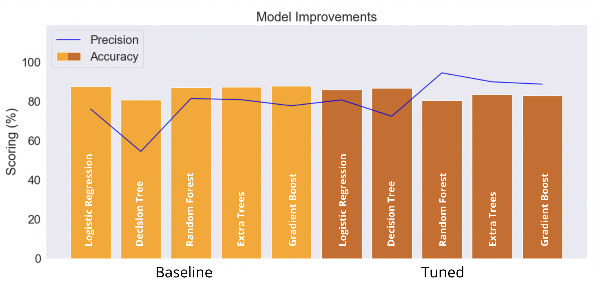
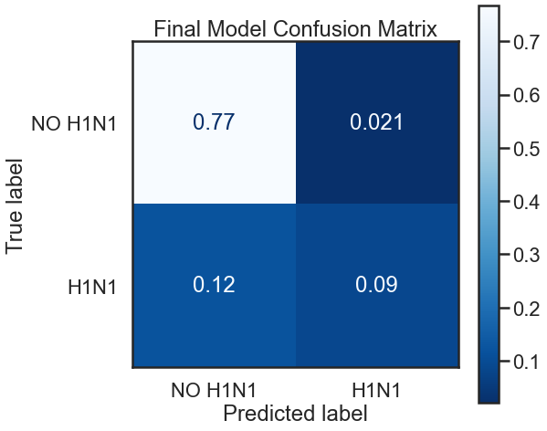
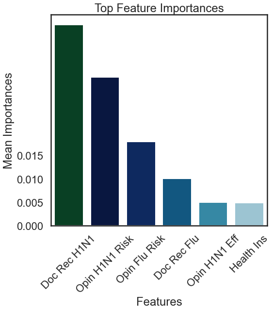
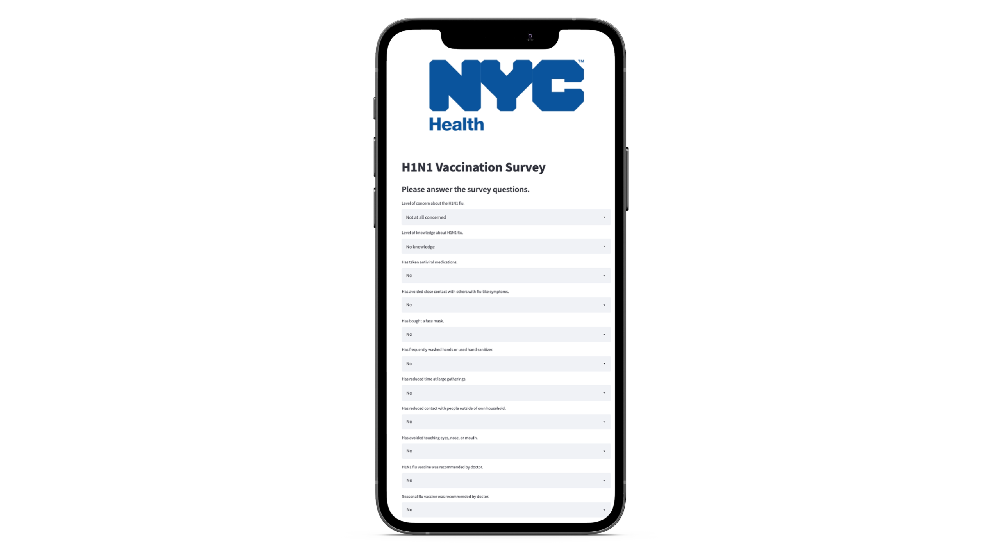

# Predicting Vaccination Status
##### Authors: Czarina Luna, Weston Shuken, Justin Sohn


## Overview
The United States flu and H1N1 vaccination rate is quite low ([50.2%](https://www.cdc.gov/flu/fluvaxview/coverage-2021estimates.htm)). This poses a problem to general public health, especially considering the high availability of vaccines and the effectiveness of flu vaccination. 

Using data from we [Drive Data](https://www.drivendata.org/competitions/66/flu-shot-learning/data/), our team of data scientists developed a model predicting the status of vaccination against the H1N1 virus, to help understand factors related to vaccination patterns.

## Stakeholder
As a leading public health agency in New York, the NYC Health Department continues to play a critical role in providing vaccinations. Our project, presentation, and machine learning model were created for use by the NYC Health Department. 


## The Business Problem 
The goal is to know what the most effective behaviors of people are to get vaccinated against the H1N1 flu virus and the seasonal flu viruses, knowing the key factors affecting the behavior and the motivations that encourage the citizens to get the vaccine, whether his/her education, age, employer affects their decision to get vaccinated or not. Also, if there is health insurance, physician recommendation, presence of chronic diseases, and working in the health care sector. Vaccination status also may be affected by human behaviors whether one is conservative or not as touching their face, meeting others in a large gathering, not wearing the mask, and not washing hands.

The main purpose of this algorithm is classification, meaning that this model should be able to take in attributes of the National 2009 H1N1 Flu and Seasonal Flu Survey dataset that shows whether the survey respondent received the seasonal flu vaccine, or whether the respondent received the H1N1 flu vaccine. The effectiveness of this classification model will be measured by how well it predicts the vaccinated individual based on his/her behavior and motivation characteristics.

## Analysis Questions 
-	Is the age a huge motivation for individual to be vaccinated?
-	Is the knowledge of the importance of the vaccine by the individual effective in his decision?
-	Are male or female more vaccinated?
-	Is the presence of chronical disease a factor pushing to be vaccinated?

## Data & Methods
The data comes from the National 2009 H1N1 Flu Survey (NHFS) and contains answers from respondents regarding demographic information, opinions on vaccinations, and behavioral information.

The data was collected via a list-assisted random-digit-dialing telephone survey of households. The target population was all persons 6 months or older living in the United States. The survey produced estimates of vaccine coverage rates for both the monovalent pH1N1 and trivalent seasonal influenza vaccines. ([Original Source](https://ftp.cdc.gov/pub/health_statistics/NCHS/Datasets/nis/NHFS/NHFSPUF_README.TXT)) 

### Analysis Graphs

Behavioral Avoidance


H1N1 Knowledge


Education


### Model Improvements
We created many machine learning models using default algorithms parameters, these are our "baseline" models. Following, we hyper-tuned parameters for optimal performance using a grid search cross-validation technique, these are our "tuned" models. These are the following models we used:
  - Logistic Regression
  - Decision Trees
  - Random Forests
  - Extra Trees
  - Gradient Boosted
  


### Precision
In our final model (using the ExtraTrees algorithm), we increased precision from **75%** to **90%**.

This means that when the model predicts that someone received the H1N1 vaccine, it is correct 90% of the time, as opposed to the baseline, which was 75% of the time. 

### Confusion Matrix




### Feature Importance



## Results & Evaluation

With our final model, we improved the ability to predict vaccination status by increasing precision from **75%** to **90%**. We can now better predict when someone actually has not received the H1N1 vaccine. Further, this model provided insights on key features related to vaccination status. 

Using this model, plus insights from the important features, the NYC Health Department can target these individuals in their vaccination efforts.

Our model provides great inference and predicts substantially better than the baseline, but there is room for improvement. We will need up-to-date data from the most recent pandemic and flu season. We are confident that our model could be used to predict the vaccination status of the next flu season, especially given the exclusive online application we designed for the NYC Health Department.

## Online Application
To deploy the final model, we created an online survey you can send to people for easy access, in time for the next flu season. Once the survey is completed, the model predicts whether the respondent will refuse or receive the vaccine, and this can direct your outreach on respondents who are predicted to not receive vaccination.


## Business Proposal Summary

#### 1. PCP Recommendation and Patient Education
  - Primary Care Physician recommends the H1N1 vaccine
  - Primary Care Physician recommends the seasonal flu vaccine
#### 2. Increase Awareness of Virus and Vaccine
  - Gear campaign content towards 
    - vaccine effectiveness 
    - H1N1 Risk
    - Flu Risk
#### 3. Incentives Uninsured Individuals
  - Provide incentive options for uninsured individuals to get vaccinated.

## Next steps
#### 1. Collect Recent Data
  - The data we used to develop our model was over 10 years old, let us use recent data to better gain insights of the current landscape of vaccination patterns.
#### 2. Deploy the Model & Application
  - Use the model to predict who may or may not get the vaccine next flu season.
  - Utilize the online application we created to mass survey individuals. 
  - An iterative approach to surveying using the application will naturally collect more data which consequently will better our predictions and reveal more insights.

---

#### For more information
Please contact the contributors to this analysis: 
[Czarina Luna](https://www.linkedin.com/in/czarinagluna) |
[Justin Sohn](https://www.linkedin.com/in/justin-sohn-689901193/) |
[Weston Shuken](https://www.linkedin.com/in/westonshuken/)


**Repository Structure:**
```
├── data preprocessing                     <- Team Member's individual notebooks 
├── data                                   <- Both sourced externally and generated from code 
├── images                                 <- Both sourced externally and generated from code 
├── .gitignore                             <- gitignore 
├── GridSearch.ipynb                       <- Supplementary documentation of gridsesarching optimal parameters
├── GridSearchSMOTE.ipynb                  <- Supplementary documentation of gridsesarching optimal parameters using SMOTE
├── README.md                              <- The top-level README for reviewers of this project
├── index.ipynb                            <- Narrative documentation of analysis in Jupyter notebook
└── presentation.pdf                       <- PDF version of project presentation
