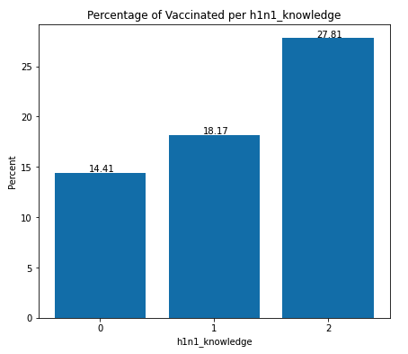

# Predicting Vaccination Status
##### Authors: Czarina Luna, Weston Shuken, Justin Sohn


## Overview
The United States flu and H1N1 vaccination rate is quite low ([50.2%](https://www.cdc.gov/flu/fluvaxview/coverage-2021estimates.htm). This poses a problem to general public health, especially considering the availability of vaccines and the effectiveness of flu vaccination. 

Using data from we [Drive Data](https://www.drivendata.org/competitions/66/flu-shot-learning/data/), our team of data scientists developed a project predicting status of vaccination against H1N1 virus, to help understand factors related to vaccination patterns.

## Stakeholder
As a leading public health agency in New York, the NYC Health Department continues to play a critical role in providing vaccinations. Our project, presenations, and machine learning model was created for the use by the NYC Health Department. 


## The Business Problem 
The goal is to know what the most effective behaviours of people are to get vaccinated against the H1N1 flu virus and the seasonal flu viruses, knowing the key factors affecting the behaviour and the motivations that encourage the citizens to get the vaccine, whether his/her education, age, employer affects their decision to get vaccinated or not. Also, if there is a health insurance, physician recommendation, presence of the chronical diseases and working in the health care sector. It also may be affected by the human behaviours whether one is conservative or not as touching face, meet others in large gathering, not wearing the mask and not washing hands.

The main purpose of this algorithm is classification, meaning that this model should be able to take in attributes of the National 2009 H1N1 Flu and Seasonal Flu Survey dataset that shows whether the survey respondent received the seasonal flu vaccine, or whether the respondent received the H1N1 flu vaccine. The effectiveness of this classification model will be measured by how well it predicts the vaccinated individual based on his/her behaviour and motivation characteristics.

## Analysis Questions 
-	Is the age a huge motivation for individual to be vaccinated?
-	Is the knowledge of the importance of the vaccine by the individual effective in his decision?
-	Are male or female more vaccinated?
-	Is the presence of chronical disease a factor pushing to be vaccinated?

## Data & Methods
The data comes from the National 2009 H1N1 Flu Survey (NHFS) and contains answers from respondants regarding demographic information, opinions on vaccinations, and behavioral information.

The data was collected via list-assisted random-digit-dialing telephone survey of households. The target population was all persons 6 moths or older living in the United States. The survey produced estimates of vaccine coverage rates for both the monovalent pH1N1 and trivalent seasonal influenza vaccines. ([Original Source](https://ftp.cdc.gov/pub/health_statistics/NCHS/Datasets/nis/NHFS/NHFSPUF_README.TXT)) 

### Analysis Graphs

Behavioral Avoidance


H1N1 Knowledge



Education


### Model Improvements
We created many machine learning models using default algorithsm, these are our baseline models. Following, we hypertuned paramentes for optimal performance using a grid search cross validation technique. These are the following models we used:
  - Logistic Regression
  - Decision Trees
  - Random Forests
  - Extra Trees
  - Gradient Boosted
  


### Precision
In our final model (using the ExtraTrees algorithm), we increased precision from **75%** to **90%**.

This means that when the model predicts that someone received the H1N1 vaccine, it is correct 90% of the time, as opposed to the baseline, which was 75% of the time. 

### Confusion Matrix


### Feature Importance


## Results
  - Improved ability to predict vaccination status.
  - Precision increased 75% ----> 90%.
  - Discovered features related to vaccination status.

## Online Application


## Business proposal
#### 1. PCP Recommendation and Patient Education
  - Recommend H1N1 vaccine
  - Recommend seasonal flu vaccine
#### 2. Increase Awareness of Virus and Vaccine
  - Real risks of getting the flu without vaccine
  - Effectiveness of vaccine

## Next steps
#### 1. Collect Recent Data
  - The data we used to develop our model was over 10 years old, let us use recent data to bettter gain isnights of the current landscape of vaccination patterns.
#### 2. Deploy the Model
  - Use the model to predict who may or may not get the vaccine next flu season.
  - Utilize the online application we created to survey indiviudals. 
  - To better our predictions, we need to take an iterative approach in surverying more and collected better data.

---

#### For more information
Please contact the contributors to this analysis: 
[Czarina Luna](https://www.linkedin.com/in/czarinagluna) |
[Justin Sohn](https://www.linkedin.com/in/justin-sohn-689901193/) |
[Weston Shuken](https://www.linkedin.com/in/westonshuken/)


**Repository Structure:**
```
├── Data Preprocessing                                        <- Team Member's indivual notebooks 
├── Data                                                      <- Both sourced externally and generated from code 
├── Images                                                    <- Both sourced externally and generated from code 
├── .gitignore                                                <- gitignore 
├── index.ipynb                                               <- Narrative documentation of analysis in Jupyter notebook
├── gridsearch.ipynb                                          <- Supplimentary documentation of gridsesarching optimal parameters
├── README.md                                                 <- The top-level README for reviewers of this project
└── presentation.pdf                                          <- PDF version of project presentation
